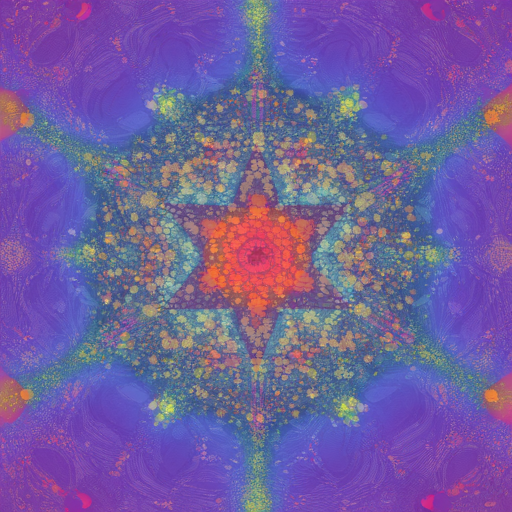

# Genuary_2024

## 🌄 Gallery

<!-- IMAGE-LIST:START - Do not remove or modify this section -->
<!-- prettier-ignore-start -->
<!-- markdownlint-disable -->
<table>
  <tbody>
    <tr>
      <td align="center"><a href="">  <b>January 1 Particles, lots of them</b></a></td>
      <td align="center"><a href="">  <b>January 2 No palettes</b></a></td>
     <td align="center"><a href="">  <b>January 3 Droste effect</b></a></td>
     <td align="center"><a href="">  <b>January 4 Pixels</b></a></td>
    </tr>
    <tr>
      <td align="center"><a href="">  <b>January 5 In the style of Vera Molnár (1924-2023)</b></a></td>
      <td align="center"><a href="">  <b>January 6  Screensaver</b></a></td>
     <td align="center"><a href="">  <b>January 7  Progress bar / indicator / loading animation</b></a></td>
     <td align="center"><a href="">  <b>January 8  Chaotic system</b></a></td>
    </tr>
    <tr>
      <td align="center"><a href="">  <b>January 9  ASCII</b></a></td>
      <td align="center"><a href="">  <b>January 10  Hexagonal</b></a></td>
     <td align="center"><a href="">  <b>January 11  In the style of Anni Albers (1899-1994)</b></a></td>
     <td align="center"><a href="">  <b>January 12  Lava lamp</b></a></td>
    </tr>
     <tr>
      <td align="center"><a href="">  <b>January 13 Wobbly function day</b></a></td>
      <td align="center"><a href="">  <b>January 14  Less than 1KB artwork</b></a></td>
     <td align="center"><a href="">  <b>January 15  Use a physics library</b></a></td>
     <td align="center"><a href="">  <b>January 16  Draw 10 000 of something</b></a></td>
    </tr>
     <tr>
      <td align="center"><a href="">  <b>January 17 Inspired by Islamic art</b></a></td>
      <td align="center"><a href="">  <b>January 18  Bauhaus</b></a></td>
     <td align="center"><a href="">  <b>January 19  Flocking</b></a></td>
     <td align="center"><a href="">  <b>January 20  Generative typography</b></a></td>
    </tr>
     <tr>
      <td align="center"><a href="">  <b>January 21  Use a library that you haven’t used before</b></a></td>
      <td align="center"><a href="">  <b>January 22  Point - line - plane</b></a></td>
     <td align="center"><a href="">  <b>January 23  8×8</b></a></td>
     <td align="center"><a href="">  <b>January 24 Impossible objects (undecided geometry).</b></a></td>
    </tr>
      <tr>
      <td align="center"><a href="">  <b>January 25  If you like generative art, you probably have some photos on your phone of cool looking patterns, textures, shapes or things that you’ve seen. You might have even thought, “I should try to recreate this with code”. Today is the day.</b></a></td>
      <td align="center"><a href="">  <b>January 26 Grow a seed</b></a></td>
     <td align="center"><a href="">  <b>January 27  Code for one hour. At the one hour mark, you’re done</b></a></td>
     <td align="center"><a href="">  <b>January 28  Skeuomorphism</b></a></td>
    </tr>
     <tr>
      <td align="center"><a href="">  <b>January 29  Signed Distance Functions (if we keep trying once per year, eventually we will be good at it!)</b></a></td>
      <td align="center"><a href="">  <b>January 30  Shaders</b></a></td>
     <td align="center"><a href="">  <b>January 31  Generative music / Generative audio / Generative sound</b></a></td>
    </tr>
     </tbody>
</table>

<!-- markdownlint-restore -->
<!-- prettier-ignore-end -->

<!-- IMAGE-LIST:END -->
